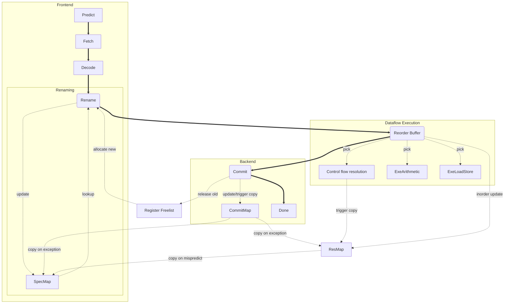

# Afviklingsplot

Afviklingsplot er en kompakt måde at anskueliggøre en computers opførsel under udførelse af et program. Det kan bruges til at gøre diskussioner af ydeevne konkrete. Afviklingsplot kan genereres ud fra regler som udgør en abstrakt beskrivelse af maskinen.

## Introduktion

Nedenfor ses et afviklingsplot for fire instruktioner på en fem-trins pipeline svarende til beskrivelsen i [COD p. 308] (det er ikke det samme program som i COD)

~~~
                        0  1  2  3  4  5  6  7  8
lw   x11,0(x10)         Fe De Ex Mm Wb
addi x11,x11,100           Fe De De Ex Mm Wb
sw   x11,0(x14)               Fe Fe De Ex Mm Wb
addi x10,x10,1                      Fe De Ex Mm Wb
~~~

Instruktionerne står til venstre, en per linie, og programmet afvikles oppefra og ned. Tiden går fra venstre mod højre og udtrykkes i clock-cykler. Af diagrammet kan man aflæse tidspunktet for hver aktivitet for hver instruktion.

I diagrammet angives følgende fem aktiviter:

~~~
Fe - Instruktionshentning (fetch)
De - Instruktionsafkodning (decode)
Ex - Udførelse af aritmetik (execute)
Mm - Tilgang til lager hvis load eller store (memory)
Wb - Opdatering af registre med resultat (writeback)
~~~

### Beskrivelse af Flow

Vi beskriver instruktioners "flow" gennem pipelinen ved at knytte en sekvens af aktiviteter til klasser af instruktioner.
I pipelinen i COD er flowet simpelt:

~~~
alle: "Fe De Ex Mm Wb"
~~~

I en simpel pipeline har alle instruktioner samme flow gennem pipelinen.

### Ressourcebegrænsninger

Vi kan beskrive maskinens ressourcer ved antallet af instruktioner som kan udføre samme aktivitet på samme tidspunkt.
For den simple pipeline angives ressourcebegrænsningen ved

~~~
Fe: 1, De: 1, Ex: 1, Mm: 1, Wb: 1
~~~
Betragt vort tidligere eksempel igen:

~~~
                        0  1  2  3  4  5  6  7  8
lw   x11,0(x10)         Fe De Ex Mm Wb
addi x11,x11,100           Fe De De Ex Mm Wb
sw   x11,0(x14)               Fe Fe De Ex Mm Wb
addi x10,x10,1                      Fe De Ex Mm Wb
~~~
Instruktion nr 2 er udsat for et "stall" - den kan ikke fuldføre aktiviteten "De" i cyklus 2 og må gentage den i cyklus 3.
Ressourcebegrænsningen for den simple pipeline tillader kun en instruktion i "De" ad gangen. Denne begrænsning tvinger instruktion nr 3 til også at "stalle" og gennemføre aktiviteten "Fe" to gange. (Vi vender tilbage til hvorfor instruktion nr 2 staller senere)

I en simpel pipeline er det praktisk at modellere det som om alle instruktioner bruger de samme ressourcer. Vi ved godt at kun load og store tilgår lageret og derfor har brug for et pipeline-trin til det formål, men da alle instruktioner tvinges igennem dette pipeline-trin kan man vælge at ignorere det.

I en mere kompliceret pipeline vil man opdele instruktionerne i flere klasser fordi forskellige instruktioner har brug for forskellige ressourcer. En tænkt eksempel: en maskine hvor kun load og store har et pipeline-trin for lagertilgang, mens de øvrige instruktioner kan gå direkte fra "Ex" til "Wb" - og "store" instruktioner kan helt undvære Wb:

~~~
load: "Fe De Ex Mm Wb"
store: "Fe De Ex Mm"
andre: "Fe De Ex Wb"
Fe: 1, De: 1, Ex: 1, Mm: 1, Wb: 1
~~~
På denne maskine får vi følgende afviklingsplot for kodestumpen fra tidligere:

~~~
                        0  1  2  3  4  5  6  7  8
lw   x11,0(x10)         Fe De Ex Mm Wb
addi x11,x11,100           Fe De De Ex Wb
sw   x11,0(x14)               Fe Fe De Ex Mm
addi x10,x10,1                      Fe De Ex Wb
~~~

### Dataafhængigheder

Dataafhængigheder specificeres ved at angive hvilke aktiviteter der producerer og/eller afhænger af en værdi. Eksempel:

~~~
load: "Fe De Ex Mm Wb"   depend(Ex,rs1), produce(Mm,rd)
store: "Fe De Ex Mm"     depend(Ex,rs1), depend(Mm,rs2)
andre: "Fe De Ex Wb"     depend(Ex,rs1), depend(Ex,rs2), produce(Ex,rd)
~~~
Her refererer "rs1", "rs2" og "rd" til de to kilderegistre og destinationsregisteret på samme måde som på den grønne side forrest i COD.
Ideen er at en instruktion der anfører depend(Ex,rs1) tidligst kan gennemføre "Ex" i en cyklus efter at rs1 er blevet produceret.

Ovenstående specifikation svarer til en pipeline med fuld forwarding og vil resultere i det afviklingsplot vi allerede har set.

Vi kan beskrive en pipeline helt uden forwarding således:

~~~
load: "Fe De Ex Mm Wb"   depend(Ex,rs1), produce(Wb,rd)
store: "Fe De Ex Mm"     depend(Ex,rs1), depend(Ex,rs2)
andre: "Fe De Ex Wb"     depend(Ex,rs1), depend(Ex,rs2), produce(Wb,rd)
~~~
Hvilket giver anledning til dette afviklingsplot:

~~~
                        0  1  2  3  4  5  6  7  8  9
lw   x11,0(x10)         Fe De Ex Mm Wb                  produce x11 i Wb i cyklus 4
addi x11,x11,100           Fe De De De Ex Wb            depend x11 i Ex i cyklus 5, produce x11 i Wb i cyklus 6
sw   x11,0(x14)               Fe Fe Fe De De Ex Mm      depend x11 i Ex i cyklus 7
addi x10,x10,1                         Fe Fe De Ex Wb
~~~

### Kontrolafhængigheder (hop, kald, retur)

Kontrolafhængigheder specificeres på samme måde som dataafhængigheder men med angivelse af et særlig register: "PC".
Eksempel:

~~~
retur: produce(Ex, PC)
alle: depend(Fe, PC)
~~~
Angiver at PC opdateres i "Ex" af retur instruktionen og at efter en retur-instruktion kan maskinen tidligst gennemføre "Fe" (instruktionshentning) for efterfølgende instruktioner, når PC er opdateret. Den sidste regel for alle instruktioner: "depend(Fe, PC)" er så indlysende at vi ikke vil anføre den fremover.

Den simpleste håndtering af betingede hop lyder:

~~~
hop taget:       produce(Ex, PC)
hop ikke taget:  -
~~~
Her har et hop der ikke tages ingen betydning for timingen af afviklingen af de efterfølgende instruktioner. Kun hop der tages vil kunne forsinke efterfølgende instruktioner.

En ofte anvendt fremgangsmåde i en simpel pipeline er at hop, der hopper mod en lavere adresse forudsiges som tagne, mens et hop der hopper mod en højere adresse forudsiges ikke tagne. Denne forudsigelse laves i "De", da man er nød til at afkode hoppet for at bestemme adressen. Det giver følgende specifikation:

~~~
hop baglæns taget:       produce(De, PC)
hop baglæns ikke taget:  produce(Ex, PC)
hop forlæns taget:       produce(Ex, PC)
hop forlæns ikke taget:  -
~~~

Her er en sekvens af instruktioner med to hop bagud, det første tages, det andet ikke:

~~~
                                0  1  2  3  4  5  6  7  8  9  10 11 12 13 14 15
0:      addi    x11,x11,4       Fe De Ex Wb
4:      lw      x12,0(x11)         Fe De Ex Mm Wb
8:      add     x13,x13,x12           Fe De De Ex Wb
C:      bne     x11,x15,0                Fe Fe De Ex            <-- NB: Betingede hop behøver ikke Wb
0:      addi    x11,x11,4                         Fe De Ex Wb
4:      lw      x12,0(x11)                           Fe De Ex Mm Wb
8:      add     x13,x13,x12                             Fe De De Ex Wb
C:      bne     x11,x15,0                                  Fe Fe De Ex
10:     et-eller-andet                                                 Fe De Ex ...
~~~

## Superskalar mikroarkitektur

En maskine der kan udføre to eller flere instruktioner samtidigt kaldes "superskalar".

### Ressourcebegrænsninger

De første superskalare kunne udføre to instruktioner samtidigt. Men det var ikke to vilkårlige instruktioner.
Det gik an at bygge en maskine med to ALUer, men de dyreste ressourcer kunne man stadig kun have en af: multiplikations-kredsløbet og tilgangen til lageret (den primære datacache).

Vi kan beskrive denne ressource-inddeling således:

~~~
load:  "Fe De Ag Mm Wb"
store: "Fe De Ag Mm"
andre: "Fe De Ex Wb"

ressourcer: Fe:2, De:2, Ex:2, Ag:1, Mm:1, Wb:2
~~~
Forkortelsen "Ag" står for "Address generate".

Her er et plot af to iterationer af en løkke der kopierer data fra et område til et andet:

~~~
                                0  1  2  3  4  5  6  7  8  9  10 11 12 13 14 15
0:     lw   x12,0(x11)          Fe De Ag Mm Wb
4:     addi x11,x11,4           Fe De Ex Wb
8:     sw   x12,0(x10)             Fe De Ag Mm
C:     addi x10,x10,4              Fe De Ex Wb
10:    bne  x11,x15,0                 Fe De Ex
0:     lw   x12,0(x11)                      Fe De Ag Mm Wb
4:     addi x11,x11,4                       Fe De Ex Wb
8:     sw   x12,0(x10)                         Fe De Ag Mm
C:     addi x10,x10,4                          Fe De Ex Wb
10:    bne  x11,x15,0                             Fe De Ex
0:     ...                                              Fe De Ex....
~~~

Bemærk at Wb i dette plot ikke gennemløbes i programrækkefølge. Det er en følge af at vi har angivet forskellige længder af "flow" for de forskellige instruktioner, samtidig med at de deler Wb. Uden at overveje det nøje har vi derved specificeret en maskine, som ikke er helt så simpel at bygge. Der er flere udfordringer:

1. Sikring af korrekt skrive-rækkefølge: Hvad hvis to instruktioner begge opdaterer samme register, men den sidste når Wb før den første?
2. Korrekt hazard-detektion og forwarding: Hvis der er flere instruktioner med samme destinationsregister in-flight, hvilken af dem matcher så en senere instruktions kilde-register?
2. Exception håndtering: Hvad hvis en instruktion med sen Wb trigger en exception, hvilket opdages i Wb eller trinnet før, mens en senere instruktion med tidlig Wb opdaterer sit destinationsregister? Den senere instruktion må logisk set ikke udføres.

Det beskrives senere hvordan disse problemer har en samlet løsning i out-of-order maskiner.

I første omgang håndterer vi problem 1 og 2 ved at tilføje en dataafhængighed på instruktionernes destinationsregister:

~~~
aritmetisk op: depend(Ex,Rs1),depend(Ex,rs2),depend(Ex,rd),produce(Wb,rd)
~~~

Dette vil sikre at der maximalt er en instruktion for hvert register i trinnene fra Ex og frem ad gangen. Det udelukker forkert skrive rækkefølge og det sikrer at operand-referencer er unikke.

Vi løser problem 3 ved at antage eksistensen af en backup-mekanisme som tager kopier af destinationsregistre før de skrives. I tilfælde af en exception bruges backuppen til at retablere registrene til den korrekte tilstand.

### Dataafhængigheder

intet nyt?

måske nogle overvejelser om omfanget af forwarding??

### Kontrolafhængigheder

Superskalare maskiner kan nemt blive begrænset af instruktionshentning. Især er betingede hop
en udfordring. Vi skal se kort på to udbredte teknikker der hjælper. En i software og en i hardware.

#### software: løkkeudrulning

En meget anvendt teknik er "løkkeudrulning". Løkkeudrulning består i at man kopierer kroppen af en 
løkke en eller flere gange, således at 2 eller flere gennemløb af den oprindelige løkkekrop i stedet
bliver et enkelt gennemløb af en ny sammensat løkkekrop. F.eks.:

~~~
Loop: <krop>
      beq Loop
LoopDone:
~~~

bliver til

~~~
Loop: <krop>
      bne LoopDone
      <krop>
      beq Loop
LoopDone:
~~~

Det er en teknik som ofte forøger programmers størrelse ganske betydeligt.

Gevinsten kan ses af følgende plot, hvor vi har udrullet løkken fra tidligere:

~~~
                                0  1  2  3  4  5  6  7  8  9  10 11 12 13 14 15
0:     lw   x12,0(x11)          Fe De Ag Mm Wb
4:     addi x11,x11,4           Fe De Ex Wb
8:     sw   x12,0(x10)             Fe De Ag Mm
C:     addi x10,x10,4              Fe De Ex Wb
10:    beq  x11,x15,0                 Fe De Ex
14:    lw   x12,0(x11)                Fe De Ag Mm Wb
18:    addi x11,x11,4                    Fe De Ex Wb
1C:    sw   x12,0(x10)                   Fe De Ag Mm
20:    addi x10,x10,4                       Fe De Ex Wb
24:    bne  x11,x15,0                       Fe De Ex
0:     ...                                        Fe De Ex....
~~~

#### hardware: afkoblet prefetcher

Det er også muligt at forbedre håndteringen af hop, kald og retur ved at smide flere hardware-ressourcer
efter problemet. En ofte anvendt fremgangsmåde går ud på at splitte pipelinen i en for-ende og en bag-ende 
adskilt af en mindre kø, hvor for-enden overdimensioneres. Dette design tillader forenden at "kigge frem"
i instruktionsstrømmen og håndtere hop, kald og retur tidligere. Det er nødvendigt at udvide pipelinen
med et trin mellem Fe og De som vi vil kalde Pq for "predict and queue". 

Denne form for mikroarkitektur kaldes "afkoblet prefetching" (eller blot "prefetching")

Her er et eksempel på specifikationen af sådan en maskine:

~~~
load: "Fe Pq De Ex Mm Wb"   depend(Ex,rs1), produce(Mm,rd)
store: "Fe Pq De Ex Mm"     depend(Ex,rs1), depend(Ex,rs2)
ubetinget hop: "Fe Pq"      -
betinget hop: "Fe Pq De Ex" depend(Ex,rs1), depend(Ex,rs2)
kald: "Fe Pq De Ex"         produce(Ex,rd)
retur: "Fe Pq De Ex"        depend(Ex,rs1)
andre: "Fe Pq De Ex Wb"     depend(Ex,rs1), depend(Mm,rs2), produce(Ex,rd)

ressourcer: Fe:4, Pq: 4, De:4, Ex:2, Ag:1, Mm:1, Wb:2

ubetinget hop:                    produce(Pq, Pc)
kald:                             produce(Pq, Pc)
retur:                            produce(Ex, Pc)
betinget hop baglæns taget:       produce(Pq, PC)
betinget hop baglæns ikke taget:  produce(Ex, PC)
betinget hop forlæns taget:       produce(Ex, PC)
betinget hop forlæns ikke taget:  -
~~~

To iterationer af vores løkke fra tidligere afsnit giver følgende plot:

~~~
                                0  1  2  3  4  5  6  7  8  9  10 11 12 13 14 15
0:     lw   x12,0(x11)          Fe Pq De Ag Mm Wb
4:     addi x11,x11,4           Fe Pq De Ex Wb
8:     sw   x12,0(x10)          Fe Pq De De Ag Mm
C:     addi x10,x10,4           Fe Pq De De Ex Wb
10:    bne  x11,x15,0              Fe Pq De Ex
0:     lw   x12,0(x11)                   Fe Pq De Ag Mm Wb
4:     addi x11,x11,4                    Fe Pq De Ex Wb
8:     sw   x12,0(x10)                   Fe Pq De De Ag Mm
C:     addi x10,x10,4                    Fe Pq De De Ex Wb
10:    bne  x11,x15,0                       Fe Pq De Ex
0:     ...                                        Fe De Ex....
~~~

#### Diskussion

I praksis er de to teknikker ikke lige gode. Løkke-udrulning hjælper kun på løkker,
mens afkoblet prefetching også hjælper på andre programkonstruktioner.

## Realisme

Lærebogens [COD] 5-trins pipeline er meget brugt i introducerende undervisning, men den er ikke
repræsentativ for nutidens mikroarkitektur. Før vi går i detaljer med mere avanceret mikroarkitektur skal
vi kigge kort på de barske realiteter i moderne CMOS.

### Sløve ledninger og hurtige transistorer

Fig 4.28 og 4.29 i [COD] angiver hvor lang tid en instruktion skal bruge til forskellige
aktiviteter i en tænkt mikroarkitektur. Balancen mellem de forskellige aktiviteter (ca samme tid til
ALU operation som til cache tilgang, f.eks.) svarer til situationen for over 20 år siden.

Der er to væsentlige ændringer siden da:
 * Kommunikation er blevet langsommere relativt til beregning
 * energiforbrug er alt dominerende begrænsning
Her vil vi kun forholde os til den første ændring.

Kommunikation inkluderer her at sende et signal en bestemt afstand såvel som at
sende et signal fra en til mange modtagere. Langsommere kommunikation 
rammer ting som læsning fra registre eller fra cache med større effekt end det rammer 
ALU-operationer. En anden ting der bliver ramt er lange forwarding-netværk.

Her er til sammenligning nogle mere realistiske tidsforbrug for forskellige aktiviteter

 * Cache læsning: 500ps (32 KByte)
 * Register læsning: 100-200ps (32 regs - 256 regs)
 * ALU operation: 100ps
 * Forwarding net: 50-100ps (afhænger af datavejens størrelse)

Bemærk at især tilgang til cache er markant langsommere relativt til resten.

### Lange pipelines

På grund af (især) den relativt langsommere tilgang til cache bliver moderne pipelines
længere end bogens. I almindelighed bruges 3 pipeline trin til cache-tilgang. Vi vil ikke
gå i detaljer med hvad der sker i disse tre trin - de er bare trin Fa,Fb og Fc samt Ma, Mb og Mc.

#### Udfordringer ved instruktionshentning
Lad os genbruge eksemplet fra den superskalare maskine med afkoblet prefetching. Maskinen ser nu således ud:

~~~
load:  "Fa Fb Fc Pq De Ex Ma Mb Mc Wb"   depend(Ex,rs1), depend(Ex,rd), produce(Mc,rd)
store: "Fa Fb Fc Pq De Ex Ma Mb Mc"      depend(Ex,rs1), depend(Mc,rs2)
ubetinget hop: "Fa Fb Fc Pq"       	      -
betinget hop:  "Fa Fb Fc Pq De Ex"       depend(Ex,rs1), depend(Ex,rs2)
kald: "Fa Fb Fc Pq De Ex"                produce(Ex,rd)
retur: "Fa Fb Fc Pq De Ex"               depend(Ex,rs1)
andre: "Fa Fb Fc Pq De Ex Wb"            depend(Ex,rs1), depend(Ex,rs2), depend(Ex,rd), produce(Ex,rd)

ressourcer: Fa:4, Fb:4, Fc4, Pq: 4, De:4, Ex:2, Ag:1, Mm:1, Wb:2

ubetinget hop:                    produce(Pq, Pc)
kald:                             produce(Pq, Pc)
retur:                            produce(Ex, Pc)
betinget hop baglæns taget:       produce(Pq, PC)
betinget hop baglæns ikke taget:  produce(Ex, PC)
betinget hop forlæns taget:       produce(Ex, PC)
betinget hop forlæns ikke taget:  -
~~~
Vort eksempel fra tidligere giver nu følgende plot:

~~~
                                0  1  2  3  4  5  6  7  8  9  10 11 12 13 14 15
0:     lw   x12,0(x11)          Fa Fb Fc Pq De Ag Ma Mb Mc Wb
4:     addi x11,x11,4           Fa Fb Fc Pq De Ex Wb
8:     sw   x12,0(x10)          Fa Fb Fc Pq De De Ag Ma Mb Mc
C:     addi x10,x10,4           Fa Fb Fc Pq De De Ex Wb
10:    bne  x11,x15,0              Fa Fb Fc Pq De Ex
0:     lw   x12,0(x11)                         Fa Fb Fc Pq De Ag Ma Mb Mc Wb
4:     addi x11,x11,4                          Fa Fb Fc Pq De Ex Wb
8:     sw   x12,0(x10)                         Fa Fb Fc Pq De De Ag Ma Mb Mc
C:     addi x10,x10,4                          Fa Fb Fc Pq De De Ex Wb
10:    bne  x11,x15,0                             Fa Fb Fc Pq De Ex
0:     ...                                                    Fa De Ex....
~~~

Det er tydeligt at den længere tilgangstid til instruktionscachen gør det vanskeligt at føde instruktioner til bagenden af maskinen hurtigt nok, selv ved brug af afkoblet prefetching.

#### Branch Target Buffer
Ofte tilføjer man en BTB (Branch Target Buffer) til designet for at forbedre instruktionshentning yderligere. En BTB er en mindre lagerblok som kan tilgås med en del af PC'en og på en enkelt cyklus levere en muligt "branch target". Det gør det muligt at omdirigere instruktionshentning i løbet af Fb, så vi får følgende afviklingsplot:

~~~
                                0  1  2  3  4  5  6  7  8  9  10 11 12 13 14 15
0:     lw   x12,0(x11)          Fa Fb Fc Pq De Ag Ma Mb Mc Wb
4:     addi x11,x11,4           Fa Fb Fc Pq De Ex Wb
8:     sw   x12,0(x10)          Fa Fb Fc Pq De De Ag Ma Mb Mc
C:     addi x10,x10,4           Fa Fb Fc Pq De De Ex Wb
10:    bne  x11,x15,0              Fa Fb Fc Pq De Ex
0:     lw   x12,0(x11)                   Fa Fb Fc Pq De Ag Ma Mb Mc Wb
4:     addi x11,x11,4                    Fa Fb Fc Pq De Ex Wb
8:     sw   x12,0(x10)                   Fa Fb Fc Pq De De Ag Ma Mb Mc
C:     addi x10,x10,4                    Fa Fb Fc Pq De De Ex Wb
10:    bne  x11,x15,0                       Fa Fb Fc Pq De Ex
0:     ...                                        Fa De Ex....
~~~

Det er selvfølgelig ikke altid at en BTB vil udpege den rette adresse, så ovenstående er et optimistisk billede.

#### Udfordringer ved den længere tilgang til datacachen
Lad os prøve med en anden kodestump, en løkke der bestemmer summen af alle elementer i en tabel, men iøvrigt samme maskine:

~~~
while (ptr < limit) { sum += *ptr++; }
~~~

To gennemløb:

~~~
						0  1  2  3  4  5  6  7  8  9
0:  lw x11,0(x10)		Fa Fb Fc Pq De Ag Ma Mb Mc Wb
4:  add x10,x10,4		Fa Fb Fc Pq De Ex Wb
8:  add x12,x12,x11		Fa Fb Fc Pq De De De De De Ex Wb
C:  bne x10,x13,0		Fa Fb Fc Pq De De De De De Ex
0:  lw x11,0(x10)		      Fa Fb Fc Pq De De De Ag Ma Mb Mc Wb
4:  add x10,x10,4		      Fa Fb Fc Pq De De De Ex Wb
8:  add x12,x12,x11		      Fa Fb Fc Pq Pq Pq Pq De De De De Ex Wb
C:  bne x10,x13,0		      Fa Fb Fc Pq Pq Pq Pq De De De De Ex
~~~

Her er instruktionshentning ikke den begrænsende faktor. I stedet ses det at instruktioner som er afhængige af en load instruktion hurtigt vil kunne putte en prop i maskinen, fordi de skal vente i "De" indtil resultatet fra load instruktionen kan forwardes i slutningen af "Mc".

### Opsamling
Moderne CMOS har langsommere kommunikation relativt til beregning end antaget i lærebogen. Det leder til længere pipelines end lærebogens, oftest med 3 trin til cache-tilgang. De længere latenstider gør det vanskeligere at udnytte potentialet i pipelining og superskalare maskiner. Instruktionshentning kan forbedres med mere avanceret "hop forudsigelse", men de langsommere load instruktioner er gift for ydeevnen.

## Dynamisk Skedulering (Out-of-order execution)

Moderne højtydende processor-kerner har samme grundlæggende design.

### Overordnet struktur (mikroarkitektur)

Figuren nedenfor illustrerer en moderne out-of-order mikroarkitektur med vægt på
flowet af instruktioner og registerreferencer.

Instruktionerne følger de tykke sorte pile. Registerreferencerne følger de tynde
pile.

Mikroarkitekturen er delt i tre overordnede sektioner:

* En "forende" som skaffer instruktioner og klargør dem til udførelse. Det gøres i programrækkefølge.
* En "bagende" som tjekker resultater for fejl (exceptions) og griber ind hvis noget er gået galt. Det gøres ligeledes i programrækkefølge
* En "midterdel" som udfører instruktionerne i en rækkefølge bestemt af deres dataafhængigheder.

Instruktionerne begynder deres vej i den forreste del af mikroarkitekturen, der 
indeholder allerede kendte elementer som forudsigelse, hentning og afkodning. 
Efter afkodning udføres *registeromdøbning* som beskrives nærmere nedenfor.
Når instruktionerne har gennemført registeromdøbning kan de udføres i dataflow rækkefølge,
dvs i en rækkefølge bestemt af deres indbyrdes afhængigheder men uden at respektere
deres oprindelige rækkkefølge i programmet. Moderne processor-kerner har plads til
flere hundrede instruktioner i deres out-of-order sektion. Slutteligt tjekkes instruktionerne
for fejlsituationer i den oprindelige programrækkefølge. Hvis en fejl er opstået
og der skal signaleres en exception, kan maskinen annullere alle instruktioner der kommer
logisk *efter* den fejlende instruktion. Det giver programmøren illusionen af at alt er udført
i programrækkefølge.

### Registeromdøbning 

På maskinsprogsniveau er (mellem)resultater placeret i registre. Disse registre kaldes
*logiske* registre. Det er de registre en programmør "ser", når han skriver assembler
programmer. I en simpel mikroarkitektur svarer hvert logisk register til *et*
*fysisk* register. En out-of-order maskine skal kunne håndtere mange instruktioner
som potentielt skriver til samme logiske register og mange instruktioner som læser
fra samme logiske register men på forskellige tidspunkter. For at kunne holde styr
på de mange resultater/registre der i brug samtidigt udføres "registeromdøbning"
(eng: register renaming). Registeromdøbning er en teknik der sikrer at forskellige 
instruktioner der skriver til samme logiske register i stedet vil skrive til hver
deres fysiske register. Registeromdøbning sikrer også at læsere af et givet logisk
register vil læse det korrekte fysiske register.

Registeromdøbning består af to elementer.

1. 

effekt? ingen? udover længere pipeline

### Forudsigelse og Spekulativ udførelse

SPAND:

CPI/IPC
resourcebegrænsninger
dataafhængigheder
kontrolafhængigheder

